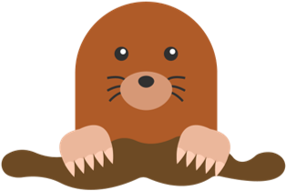
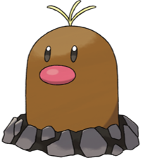
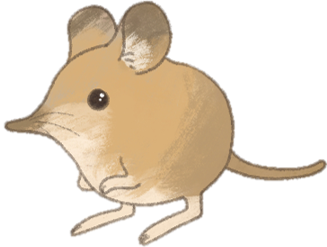
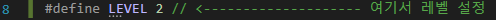
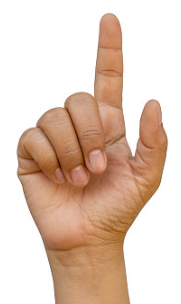

# 두더지 잡기 설명서

## 게임 규칙

두더지를 잡자. 검지손가락을 두더지 위로 이동하면 잡을 수 있다.

두더지

특별한 두더지는 점수를 더 많이 받을 수 있다.

특별한 두더지

그러나 땃쥐는 잡지 말자. 잡으면 큰 감점을 받을 수 있다.

땃쥐는 귀엽기 때문

제한 시간 : 30초

총 3가지 레벨 : 높은 레벨에서는 더 많은 두더지가 나오고 빨리 사라집니다.

level1: 두더지 총 10개, 지속시간 3초

level2: 두더지 총 15개, 지속시간 2초

level3: 두더지 총 20개, 지속시간 1초

---

## 시작 방법

1. 이미 실행되고 있는 콘솔 창이 있다면 끝내주세요.
2. 네트워크가 정상인지 확인해주세요.
3. 레벨을 변경하려면 LEVEL 값을 바꿔주세요. (기본: 2)

1.  `Ctrl`+`F5`로 실행해주세요.
2. 아래 주의사항대로 카메라 위치를 설정해주세요. (노란 동그라미가 검지를 잘 따라오게끔) 
3. 마우스로 창을 한번 클릭해서 **포커스를 ‘두더지를 잡자’ 창에 놓고** 키보드의 아무키를 눌러주세요. 
4. 3~5초 정도 기다리면 시작됩니다. (잠깐 응답없음으로 뜰 수도 있음)

---

## 주의사항

손 인식률을 높이기 위해 

1. 최대한 **깨끗한 배경**에서 
2. 얼굴이 많이 안나오고
3. 너무 멀거나 너무 가깝지 않도록
4. **한 손**만 화면에 나오고, **그 손의 전체가** 다 나오도록 해주세요.
    
    
    

---

## 종료 방법

강제 종료 : `esc`키

게임 끝난 후 종료 : 아무키나 누르세요.

---

## 실행 예시

